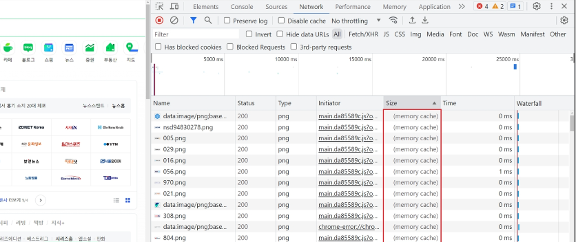

# Basic Syntax - 02

## Computed Properties

## Computed

### computed()
- 계산된 속성을 정의하는 함수
- -> 미리 계산된 속성을 사용하여 템플릿에서 표현식으로 단순하게 하고 불필요한 반복 연산을 줄임

### computed 기본 예시
- 할 일이 남았는지 여부에 따라 다른 메시지를 출력하기

- -> 템플릿이 복잡해지며 todos에 따라 계산을 수행하게 됨
- -> 만약 이 계산을 템플릿에 여러 번 사용하는 경우에는 반복이 발생

#### computed 적용
- 반응성 데이터를 포함하는 복잡한 로직의 경우 computed를 활용하여 미리 값을 계산
- computed는 callback 함수를 인자로 받는다

### computed 특징
- 반환되는 값은 computed ref이며 일반 refs와 유사하게 계산된 결과를 .value로 참조 할 수 있음 (템플릿에서는 .value 생략 가능)
- computed 속성은 의존된 반응형 데이터를 "자동으로 추적"
- 의존하는 데이터가 변경될 때만 재평가
  - restOfTodos의 계산은 todos에 의존하고 있음
  - 따라서 'todos가 변경될 때만 restOfTodos가 업데이트'됨

## Computed vs Methods

### computed와 동일한 로직을 처리할 수 있는 method
- computed 속성 대신 method로도 동일한 기능을 정의할 수 있음
- 두 가지 접근 방식은 실제로 완전히 동일

### computed와 method 차이
- computed 속성은 "의존된 반응형 데이터를 기반으로 캐시(cached)된다"
- 의존하는 데이터가 변경된 경우에만 재평가됨
- 즉, 의존된 반응형 데이터가 변경되지 않는 한 이미 계산된 결과에 대한 여러 참조는 다시 평가할 필요 없이 이전에 계산된 결과를 즉시 반환

- -> 반면, method 호출은 다시 렌더링이 발생할 때마다 항상 함수를 실행

### Cache(캐시)
- 데이터나 결과를 일시적으로 저장해두는 임시 저장소
- 이후에 같은 데이터나 결과를 다시 계산하지 않고 빠르게 접근할 수 있도록 함

### Cache 예시
- "웹 페이지의 캐시 데이터"
  - 페이지 일부 데이터를 브라우저 캐시에 저장 후 같은 페이지에 다시 요청 시 모든 데이터를 다시 응답 받는 것이 아닌 캐시 된 데이터를 사용하여 더 빠르게 웹 페이지를 렌더링
  - 이미지를 다시 그리는 건 굉장히 큰 리소스

### computed와 method의 적절한 사용처
- computed
  - 의존하는 데이터에 따라 결과가 바뀌는 계산된 속성을 만들 때 유용
  - 동일한 의존성을 가진 여러 곳에서 사용할 때 계산 결과를 캐싱하여 중복 계산 방지
  - 의존된 데이터가 변경되면 자동으로 업데이트

- method
  - 단순히 특정 동작을 수행하는 함수를 정의할 때 사용
  - 데이터에 의존하는지 여부와 관계없이 항상 동일한 결과를 반환하는 함수
  - 호출 해야만 실행됨

- -> 무조건 computed만 사용하는 것이 아니라 사용 목적과 상황에 맞게 computed와 method를 적절히 조합하여 사용

## Conditional Rendering

## v-if
- 표현식 값의 T/F를 기반으로 요소를 조건부로 렌더링

### v-if 예시
- 'v-else' directive를 사용하여 v-if에 대한 else 블록을 나타낼 수 있음

- false일 경우 렌더 조차 안됨

- 'v-else-if' directive를 사용하여 v-if에 대한 else if 블록을 나타낼 수 있음

### 여러 요소에 대한 v-if 적용
- v-if는 directive이기 때문에 단일 요소에만 연결 가능
- 이 경우 'template' 요소에 v-if를 사용하여 하나 이상의 요소에 대해 적용 할 수 있음 (v-else, v-else-if 모두 적용 가능)

### HTML <template> element
- 페이지가 로드 될 때 렌더링 되지 않지만 JavaScript를 사용하여 나중에 문서에서 사용할 수 있도록 하는 HTML을 보유하기 위한 메커니즘
- "보이지 않는 wrapper 역할"

## v-if vs v-show

### v-show
- 표현식 값의 T/F를 기반으로 요소의 가시성(visibility)을 전환

### v-show 예시
- v-show 요소는 항상 렌더링 되어 DOM에 남아있음
- CSS display 속성만 전환하기 때문

- display:none
- 일단 렌더링을 한다 but 가시성을 결정한다

### v-if vs v-show
- v-if (Cheap inital load, expensive toggle)
  - 초기 조건이 false인 경우 아무 작업도 수행하지 않음
  - 토글 비용이 높음
  - else, else if 존재

- v-show (Expensive initial load, cheap toggle)
  - 초기 조건에 관계 없이 항상 렌더링
  - 초기 렌더링 비용이 더 높음

- -> 무언가를 매우 자주 전환해야 하는 경우에는 v-show를, 실행 중에 조건이 변경되지 않는 경우에는 v-if를 권장

## List Rendering

## v-for
- 소스 데이터 (반복 가능한 데이터) (Array, Object, number, string, Iterable)를 기반으로 요소 또는 템플릿 블록을 여러 번 렌더링

### v-for 구조
- v-for는 'alias in expression' 형식의 특수 구문을 사용하여 반복되는 현재 요소에 대한 별칭(alias)을 제공

- 인덱스(객체에서는 키)에 대한 별칭을 지정할 수 있음

### v-for 예시

- 배열 반복

- 객체 반복
  

### 여러 요소에 대한 v-for 적용
- template 요소에 v-for를 사용하여 하나 이상의 요소에 대해 반복 렌더링 할 수 있음

- template 태그는 출력 안됨

### 중첩된 v-for
- 각 v-for 범위는 상위 범위에 접근 할 수 있음

- 하위 요소의 alias를 상위 요소의 alias에서 출력할 순 없다

## v-for with key

### 반드시 v-for와 key를 함께 사용한다
- 내부 컴포넌트의 상태를 일관되게 유지

- -> 데이터의 예측 가능한 행동을 유지 (Vue 내부 동작 관련)

### v-for와 key
- key는 반드시 각 요소에 대한 고유한 값을 나타낼 수 있는 식별자여야 함
- 눈으로 볼 때는 별 차이는 없지만 내부적인 리스트 렌더링의 일관성을 유지하겠다

## v-for with v-if

### 동일 요소에 v-for와 v-if를 함께 사용하지 않는다
- 동일한 요소에서 v-if가 v-for보다 우선순위가 더 높기 때문

- -> v-if 조건은 v-for 범위의 변수에 접근할 수 없음

### v-for와 v-if 문제 상황 - 1
- todo 데이터 중 이미 처리 한 (isComplete === true) todo만 출력하기

### v-for와 v-if 해결법 - 1
- "computed를 활용해 필터링 된 목록을 반환하여 반복"하도록 설정

### v-for와 v-if 문제 상황 - 2
- v-if가 더 높은 우선순위를 가지므로 v-for의 todo 요소를 v-if에 사용할 수 없음

### v-for와 v-if 해결법 - 2
- v-for와 template 요소를 사용하여 v-if를 이동
  

- 반복문 안에서 v-if를 활용하면 사용할 수 있게 된다

## Watchers

### watch()
- 반응형 데이터를 감시하고 감시하는 데이터가 변경되면 콜백 함수를 호출

### watch 구조

- variable
  - 감시하는 변수

- newValue
  - 감시하는 변수가 변화된 값
  - 콜백 함수의 첫번째 인자

- oldValue
  - 변화되기 전의 값
  - 콜백 함수의 두번째 인자

### watch 예시
1. 감시하는 변수에 변화가 생겼을 때 기본 동작 확인하기
- watch는 리턴하지 않음

2. 감시하는 변수에 변화가 생겼을 때 연관 데이터 업데이트 하기
   

### Computed와 Watchers

- computed와 watch 모두 의존(감시)하는 원본 데이터를 직접 변경하지 않음

## Lifecycle Hooks
- Vue 인스턴스의 생애주기 동안 특정 시점에 실행되는 함수

- -> 개발자가 특정 단계에서 의도하는 로직이 실행될 수 있도록 함

### Lifecycle Hooks 예시

1. Vue 컴포넌트 인스턴스가 초기 렌더링 및 DOM 요소 생성이 완료된 후 특정 로직을 수행하기

2. 반응형 데이터의 변경으로 인해 컴포넌트 DOM이 업데이트된 후 특정 로직을 수행하기

### Lifecycle Hooks 특징
- Vue는 Lifecycle Hooks에 등록된 콜백 함수들을 인스턴스와 자동으로 연결함
- 이렇게 동작하려면 hooks 함수들은 반드시 동기적으로 작성되어야 함
- 인스턴스 생애 주기의 여러 단계에서 호출되는 다른 hooks도 있으며, 가장 일반적으로 사용되는 것은 onMounted, onUpdated, onUnmounted
- https://ko.vuejs.org/api/composition-api-lifecycle.html

### Lifecycle Hooks Diagram
- https://vuejs.org/guide/essentials/lifecycle.html#lifecycle-diagram

- mounted를 통해 사진을 불러오고 새로고침 해도 이미 불러왔기 때문에 버튼을 다시 안눌러 줘도 된다

## 참고

## Vue Style Guide
- Vue 스타일 가이드 규칙은 우선순위에 따라 4가지 범주로 나눔
- 규칙 범주
  - 우선순위 A : 필수 (Essential)
  - 우선순위 B : 적극 권장 (Strongly Recommended)
  - 우선순위 C : 권장 (Recommended)
  - 우선순위 D : 주의 필요 (Use with Caution)

- https://ko.vuejs.org/style-guide/

### 우선순위 별 특징
- A : 필수 (Essential)
  - 오류를 방지하는 데 도움이 되므로 어떤 경우에도 규칙을 학습하고 준수

- B : 적극 권장 (Strongly Recommended)
  - 가독성 및/또는 개발자 경험을 향상시킴
  - 규칙을 어겨도 코드는 여전히 실행되겠지만, 정당한 사유가 있어야 규칙을 위반할 수 있음

- C : 권장 (Recommended)
  - 일관성을 보장하도록 임의의 선택을 할 수 있음

- D : 주의 필요 (Use with Caution)
  - 잠재적 위험 특성을 고려함

### [주의] computed의 반환 값은 변경하지 말 것
- computed의 반환 값은 의존하는 데이터의 파생된 값
- 일종의 snapshot이며 의존하는 데이터가 변경될 때마다 새 snapshot이 생성됨
- snapshot 을 변경하는 것은 의미가 없으므로 계산된 반환 값은 읽기 전용으로 취급되어야 하며 변경되어서는 안됨
- 대신 새 값을 얻기 위해서는 의존하는 데이터를 업데이트 해야 함
- computed에서 reverse() 및 sort() 사용 시 원본 배열을 변경하기 때문에 복사본을 만들어서 진행 해야 함

### [주의] 배열의 인덱스를 v-for의 key로 사용하지 말 것

- 인덱스는 식별자가 아닌 배열의 항목 위치만 나타내기 때문에 Vue가 DOM을 변경 할 때 (끝이 아닌 위치에 새 항목이 배열에 삽입되면) 여러 컴포넌트간 데이터 공유 시 문제가 발생
- -> 직접 고유한 값을 만들어내는 메서드를 만들거나 외부 라이브러리 등을 활용하는 등 식별자 역할을 할 수 있는 값을 만들어 사용