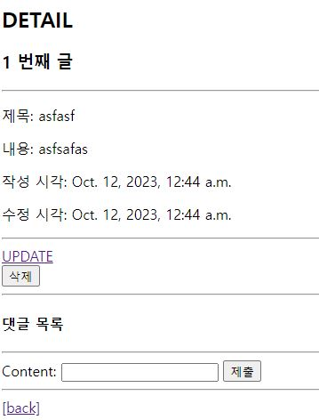

# Many to one relationships 2

## 개요

### Article(N) - User(1)
- 0개 이상의 게시글은 1명의 회원에 의해 작성될 수 있다.

### Comment(N) - User(1)
- 0개 이상의 댓글은 1명의 회원에 의해 작성 될 수 있다.

## Article & User

## 모델 관계 설정

### Article - User 모델 관계 설정


- User 외래 키 정의
- N쪽에 외래 키 설정

### User 모델을 참조하는 2가지 방법
- django 프로젝트의 '내부적인 구동 순서'와 '반환 값'에 따른 이유
- -> 우리가 기억할 것은 User 모델은 직접 참조하지 않는다는 것


- 서버를 가동할 때 models.py가 구동이 될 때 User 객체가 django에 존재하지 않은 경우가 발생할 수 있다
- django 버전 3 이상 부턴 에러가 발생하지는 않지만 다른 앱들간의 설정에 의해 문제가 발생할 가능성이 있다

### Migration


- 기본적으로 모든 컬럼은 NOT NULL 제약조건이 있기 때문에 데이터가 없이는 새로운 필드가 추가되지 못함
  - 기본값 설정 필요

- 1을 입력하고 Enter 진행 (다음 화면에서 직접 기본 값 입력)


- 추가되는 외래키 user_id에 어떤 데이터를 넣을 것인지 직접 입력해야함
- 마찬가지로 1 입력하고 Enter 진행
- 그러면 기존에 작성된 게시글이 있다면 모두 1번회원이 작성한 것으로 처리됨


- migrations 파일 생성 후 migrate 진행


- article 테이블의 user_id 필드 생성 확인

## 게시글 CREATE

### 게시글 CREATE


- 기존 ArticleForm 출력 변화 확인
- User 모델에 대한 외래 키 데이터 입력을 위해 불필요한 input이 출력
- 다른 사람이 내가 글을 쓴 것처럼 할 수도 있음


- ArticleForm 출력 필드 수정


- 게시글 작성 시 에러 발생
- user_id 필드 데이터가 누락되었기 때문
- 게시글의 작성자가 없다


  
- 게시글 작성 시 작성자 정보가 함께 저장될 수 있도록 save의 commit 옵션 활용




- 게시글 작성 후 테이블 확인

## 게시글 READ


- 각 게시글의 작성자 이름 출력

```python

def __str__(self):
    return self.username

```
- 매직메서드로 username까지 작성되어 있어 request.user 까지만 작성하여도 가능하다

## 게시글 UPDATE

### 게시글 UPDATE
- 게시글 수정 요청 사용자와 게시글 작성 사용자를 비교하여 본인의 게시글만 수정할 수 있도록 하기


- 해당 게시글의 작성자가 아니라면, 수정/삭제 버튼을 출력하지 않도록 하기


## 게시글 DELETE

### 게시글 DELETE
- 삭제를 요청하려는 사람과 게시글을 작성한 사람을 비교하여 본인의 게시글만 삭제할 수 있도록 하기


## Comment & User

### Comment-User 모델 관계 설정


### Migration

- 이전에 Article 와 User 모델 관계 설정 때와 동일한 상황
- 기존 Comment 테이블에 새로운 컬럼이 빈 값으로 추가 될 수 없기 때문에 기본 값 설정 과정이 필요


## 댓글 CREATE

### 댓글 CREATE
- 댓글 작성 시 이전에 게시글 작성할 때와 동일한 에러 발생
- 댓글의 user_id 필드 데이터가 누락되었기 때문


- 댓글 작성 시 작성자 정보가 함께 저장할 수 있도록 작성


## 댓글 READ

- 댓글 출력 시 댓글 작성자와 함께 출력


## 댓글 DELETE

- 댓글 삭제 요청 사용자와 댓글 작성 사용자를 비교하여 본인의 댓글만 삭제 할 수 있도록 하기


- 해당 댓글의 작성자가 아니라면, 댓글 삭제 버튼을 출력하지 않도록 함


## 참고

### 인증된 사용자만 댓글 작성 및 삭제

