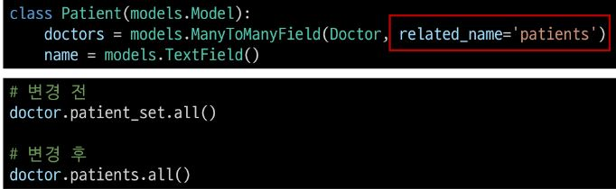
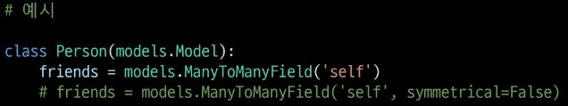

# Many to many relationships 1

## Many to many relationships

### Many to many relationships (N:M or M:N)
- 한 테이블의 0개 이상의 레코드가 다른 테이블의 0개 이상의 레코드와 관련된 경우
- "양쪽 모두에서 N:1 관계를 가짐"

### M:N 관계의 역할과 필요성 이해하기
- '병원 진료 시스템 모델 관계'를 만들며 M:N 관계의 역할과 필요성 이해하기
- 환자와 의사 2개의 모델을 사용하여 모델 구조 구상하기
  
## N:1의 한계

### 의사와 환자 간 모델 관계 설정
- 한명의 의사에게 여러 환자가 예약할 수 있다고 설계

### 의사와 환자 데이터 생성
- 2명의 의사와 환자를 생성하고 환자는 서로 다른 의사에게 예약

### N:1의 한계 상황
- 1번 환자(carol)가 두 의사 모두에게 진료를 받고자 한다면 환자 테이블에 1번 환자 데이터가 중복으로 입력될 수 밖에 없음

- 동시에 예약을 남길 수는 없다

- 동일한 환자지만 다른 의사에게도 진료 받기 위해 예약하기 위해서는 객체를 하나 더 만들어 진행해야 함
- 외래 키 컬럼에 '1,2' 형태로 저장 및 참조하는 것은 DB 타입 문제로 불가능
- -> "예약 테이블을 따로 만들자"

## 중개 모델

### 예약 모델 생성

- 환자 모델의 외래 키를 삭제하고 별도의 예약 모델을 새로 생성
- 예약 모델은 의사와 환자에 각각 N:1 관계를 가짐

### 예약 데이터 생성
- 데이터 베이스 초기화 후 Migration 진행 및 shell_plus 실행
- 의사와 환자 생성 후 예약 만들기

### 예약 정보 조회
- 의사와 환자가 예약 모델을 통해 각각 본인의 진료 내역 확인
- 역참조 

### 추가 예약 생성
- 1번 의사에게 새로운 환자 예약 생성

### 예약 정보 조회
- 1번 의사의 예약 정보 조회
  

- Reservation 중심으로 환자와 의사 예약을 다루고 있음 좀 더 자유로운 방법을 사용할 수 있다.

### Django에서는 'ManyToManyField'로 중개 모델을 자동으로 생성

## ManyToManyField

### Django ManyToManyField
- 환자 모델에 ManyToManyField 작성
- ManyToManyField는 복수형으로 작성을 권고

- 데이터베이스 초기화 후 Migration 진행 및 shell_plus 실행
- 생성된 중개 테이블 hospitals_patient_doctors 확인

- 의사  1명과 환자 2명 생성

- 예약 생성 (환자가 예약)

- patient1이 doctor1에게 예약
- patient1 - 자신이 예약한 의사목록 확인
- doctor1 - 자신의 예약된 환자목록 확인
- 역참조 명령어를 사용 (본인의 외래키를 가진 클래스를 참조)
- 다대다 관계는 서로에게 종속되지 않는다 따라서 Doctor나 Patient 어디든 ManyToManyFiewld를 작성할 수 있다.

- 예약 생성(의사가 예약)

- doctor1이 patient2을 예약
- doctor1 - 자신의 예약 환자목록 확인
- patient1, 2 - 자시이 예약한 의사목록 확인

- 중개 테이블에서 예약 현황 확인

- 예약 취소하기(삭제)
- 이전에는 Reservation을 찾아서 지워야 했다면, 이제는 .remove()로 삭제 가능

- doctor1이 patient1 진료 예약 취소
  

- patient2가 doctor1 진료 예약 취소
  

### 만약 예약 정보에 증상, 예약일 등 추가 정보가 포함되어야 한다면?

## 'through' argument

### 'through' argument
- 중개 테이블에 '추가 데이터'를 사용해 M:N 관계를 형성하려는 경우에 사용

### 'through' argument 예시

- through 설정 및 Reservation Class 수정
- 이제는 예약 정부에 "증상"과 "예약일"이라는 추가 데이터가 생김

- 데이터베이스 초기화 후 Migration 진행 및 shell_plus 실행
- 의사 1명과 환자 2명 생성

- 예약 생성 방법 - 1
- Reservation class를 통한 예약 생성

- 예약 생성 방법 - 2
- Patient 객체를 통한 예약 생성 (through_defaults)

- 의사와 환자가 각각 예약 삭제

### M:N 관계 주요 사항
- M:N 관계로 맺어진 두 테이블에는 물리적인 변화가 없음
- ManyToManyField는 중개 테이블을 자동으로 생성
- ManyToManyField는 M:N 관계를 맺는 두 모델 어디에 위치해도 상관 없음
  - 대신 필드 작성 위치에 따라 참조와 역참조 방향을 주의할 것
- N:1은 완전한 종속의 관계였지만 M:N은 종속적인 관계가 아니며 '의사에게 진찰받는 환자 & 환자를 진찰하는 의사' 이렇게 2 가지 형태 모두 표현 가능

## Django ManyToManyField

### ManyToManyField(to, **options)
- Many to many 관계 설정 시 사용하는 모델 필드

### ManyToManyField's Arguments
1. related_name
2. symmetrical
3. through

### 'related_name' arguments
- 역참조 시 사용하는 manager name을 변경

### 'symmetrical' arguments
- ManyToManyField가 동일한 모델을 가리키는 정의에서만 사용
- 기본 값 : True

- True 일 경우
  - source 모델의 인스턴스가 target 모델의 인스턴스를 참조하면 자동으로 target 모델 인스턴스도 source 모델 인스턴스를 자동으로 참조하도록 함(대칭)
  - 즉, 자동으로 내가 당신의 친구라면 당신도 내 친구가 됨
  - 팔로우와 팔로잉이 한번에 올라가는 상황 발생

- False일 경우
  - True 였을 때와 반대 (대칭되지 않음)

### M:N에서의 methods
- add()
  - "지정된 객체를 관련 객체 집합에 추가"
  - (이미 존재하는 관계에 사용하면 관계가 복제되지 않음)

- remove()
  - "관련 객체 집합에서 지정된 모델 객체를 제거"

## 좋아요

## 모델 관계 설정

### Many to many relationships (N:M or M:N)
- 한 테이블의 0개 이상의 레코드가 다른 테이블의 0개 이상의 레코드와 관련된 경우 (양쪽 모두 N:1 관계를 가짐)

### Article(M) - User(N)
- 0개 이상의 게시글은 0명 이상의 회원과 관련
- -> 게시글은 회원으로부터 0개 이상의 좋아요를 받을 수 있고, 회원 0개 이상의 게시글에 좋아요를 누를 수 있음

### 모델 관계 설정
- ManyToManyField 작성

- 게시글 입장에서는 영화 게시글 작성 유저 혹은 게시글을 "좋아요"한 유저 (N:1)
- 유저 입장에서는 (역참조)
- 특정 유저가 "좋아요"한 게시글 (M:N)

- Migration 진행 후 에러 발생

### user.article_set 역참조 매니저 충돌
- N:1
  - "유저가 작성한 게시글"

- M:N
  - "유저가 좋아요 한 게시글"

- like_users 필드 생성 시 자동으로 역참조 .article_set 매니저가 생성됨
- 그러나 이전 N:1(Article-User) 관계에서 이미 같은 이름의 매니저를 사용 중
  - user.article_set.all() -> 해당 유저가 작성한 모든 게시글 조회
- 'user가 작성한 글(user.article_set)'과 'user가 좋아요를 누른 글(user.article_set)'을 구분할 수 없게 됨
- -> user와 관계된 ForeignKey 혹은 ManyToManyField 둘 중 하나에 related_name 작성 필요

### 모델 관계 설정

- related_name 작성 후 Migration 재진행

- 생성된 중개 테이블 확인
- 실제로 article이란 테이블에 물리적으로 들어가는 테이블이 아니다

### User - Article 간 사용 가능한 전체 related managet
- article.user
  - 게시글을 작성한 유저 - N:1
  
- user.article_set
  - 유저가 작성한 게시글(역참조) - N:1

- article.like_users
  - 게시글을 좋아요 한 유저 - M:N
  
- user.like_articles
  - 유저가 좋아요 한 게시글(역참조) - M:N

## 좋아요 기능 구현

### 좋아요 기능 구현

- if 만약에 인증된 user 라면
  - if 만약에 아티클에 좋아요를 한 유저들 중에 요청을 보낸 해당 유저가 존재한다면 해당 유저의 라이크를 지우고
  - else 그게 아니라면 해당 유저의 라이크를 더한 후 해당 게시물의 디테일 페이지로 간다. 로그인이 되어 있지않다면 로그인 페이지로 리다이렉트 한다.

- if 만약에 user.movie_set.all (해당 게시글에 라이크를 누른 모드 유저중에) in 방금 라이크를 누른 해당 유저 request.user가 이미 있다면 "좋아요 취소"가 작동 될 것이고 else 그게 아니면 "좋아요"가 눌릴 것이다.

- form에서 like users를 exclude 해준다.

