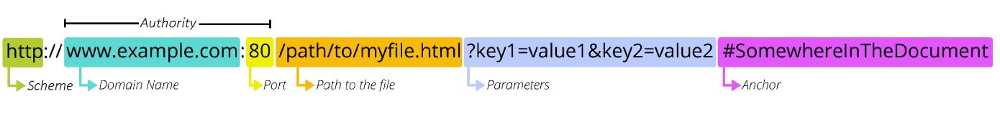
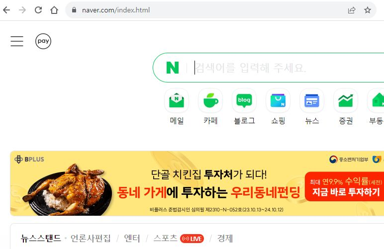
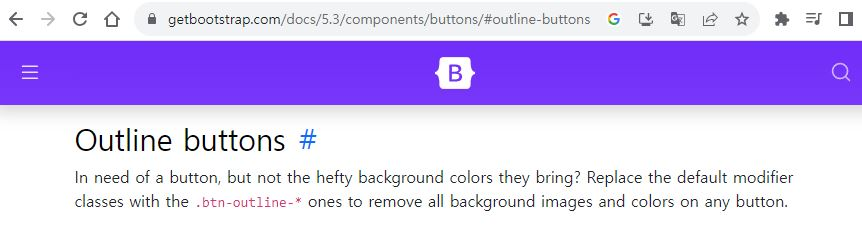
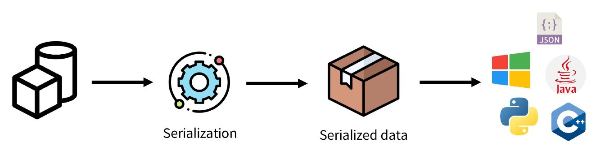
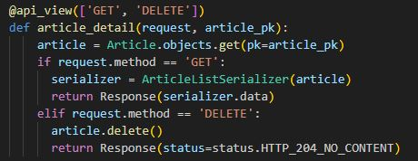

# Django REST framework 1

## REST API

### API
- Application Programming Interface
- 애플리케이션과 프로그래밍으로 소통하는 방법
- -> 클라이언트-서버처럼 서로 다른 프로그램에서 요청과 응답을 받을 수 있도록 만든 체계

- 클라이언트가 URL을 통해서 서버로 요청을 하는데 어떤형식의 URL을 사용해서 서버로 요청을 해야 하는지 다 정해져 있다.
  - (www.???????????)

### API 란
- 예를 들어 우리 집 냉장고에 전기를 공급해야 한다고 가정해보자
- 우리는 그냥 냉장고의 플러그를 소켓에 꽂으면 제품이 작동한다
- 중요한 것은 우리가 가전 제품에 전기를 공급하기 위해 직접 배선을 하지 않는다는 것이다
- 이는 매우 위험하면서도 비효율적인 일이기 때문이다
- -> 복잡한 코드를 추상화하여 대신 사용할 수 있는 몇 가지 더 쉬운 구문을 제공

- 서버 개발자가 정해놓은 형식에 맞게 요청을 보내야 하는데 서버 개발자가 정해놓은 요청방식을 API라고 한다.

  - (API: Application Programming Interface) 

    - (예> 티비 <-> 리모컨 (API) <-> 시청자)
    - (예> 자판기 <-> 자판기버튼 (API) <-> 음료수)
    - (예> 서버 <-> URL (API) <-> 클라이언트)

### Web API
- 웹 서버 또는 웹 브라우저를 위한 API
- 현대 웹 개발은 하나부터 열까지 직접 개발하기보다 여러 Open API들을 활용하는 추세
- 대표적인 Third Party Open API 서비스 목록
  - Youtube APi
  - Google Map API
  - Naver Papago API
  - Kakao Map API

### REST
- Representational State(데이터) Transfer
- API에선 데이터를 자원이라고 부름
- API Server를 개발하기 위한 일종의 소프트웨어 설계 방법론 "약속(규칙X)"

### RESTful API
- REST 원리를 따르는 시스템을 RESTful 하다고 부름
- "자원(데이터)를 정의" 하고 "자원에 대한 주소를 지정" 하는 전반적인 방법을 서술
- "각각 API 구조를 작성하는 모습이 너무 다르니 약속을 만들어서 다같이 통일해서 쓰자!"

```
앞서 API 에대해서 설명했다.
그런데 서버마다 요청보내는 방식이 중구난방이다 보면 요청을 보내는 사람 (클라이언트) 입장에서는
너무 피곤한 일이다. 각기 다른 서버에 요청을 보낼 때 마다 각각의 요청방식을 하나씩 다 확인해야 하기 때문이다.

그래서 각 API구조를 작성하는 모습이 너무 다르니까 앞으로는 그러지 말고, 약속을 하나 만들어서
서버에서 API 만드는 방식을 통일을 좀 하자. 어떻게? REST라는 설계방식에 따라 API를 구현하자.라고 
해서 나온게 RESTFUL API다. 그리고 restful api를 일반적으로 rest api 라고 부른다.

그럼 REST 설계방식은 무엇인가? 
1. HTTP 프로토콜을 기반으로 
2. URI와 HTTP 메서드를 사용해서 
3. 클라이언트와 서버간에 소통할 수 있게 만든 구조를 말한다.

예를들어 보겠다.
만약에 A라는 개발자와 B라는 개발자가 함께 영화리뷰를 하는 사이트를 만드는데 
뒤늦게 C 그리고 D라는 개발자도 한 참 뒤에 뒤늦게 투입이 되었다. 
C,D 개발자가 본 프로젝트에 투입 되기 전에
A 개발자가 게시판 id가 1인곳에 영화의 정보를 요청을 보내는 주소를  
https://사이트도메인/1 이라고 만들었다고 가정해보자.

뒤늦게 투입 된 C,D 개발자는 A가 만들어 놓은 https://사이트도메인/1 주소만 봐서는 
클라이언트가 서버로 무엇을 어떻게 요청을 보낸 것인지 URL만 보고는 도무지 추측이 안될 것이다. 
한번에 알수가 없을 것이다.

그런데 RESTFUL 하게 개발을 한 후에 
클라이언트가 서버로 요청을 보내는 주소를 예를 들자면
https://사이트도메인/comedy/kor/최민식?voterate=5&release=2000 라고 하자. 
요청을 보내는 웹 주소만 보아도
코메디 라는 클래스에 한국영화 중 최민식이 나온 영화 중 조건을 붙여서 평점이 5점이고 개봉일이 2000인 작품의 정보를 요청하고 있구나라고 어느정도 예측이 가능 할 수 있을 것이다.

따라서 서버로 정보를 요청할 때 요청의 의도를 쉽게 파악할 수 있도록 restful 하게 개발을 해야 한다.
개발에 있어서 RESTFUL 하다라는 것은 REST의 원리 및 설계규칙을 따르는 시스템을 일컫는다.

REST 설계규칙 중 중요한 몇가지를 명시하자면 다음과 같다.

1. URL은 동사X 명사O 사용한다.
2. URL마지막에 / 포함하지 않는다.
3. 언더바(_) 사용안하고 하이픈 (-) 사용한다. 
4. 파일 확장자, 예를들어 jpg 등은 URI 에 포함하지 않는다.
5. 행위(delete post get put) 등은 URI에 포함하지 않는다. 등이 있다.
```
### REST API
- REST라는 설계 디자인 약속을 지켜 구현한 API

### REST API 실제 예시


### REST에서 자원을 정의하고 주소를 지정하는 방법
1. 자원의 식별
   - URI
2. 자원의 행위
   - HTTP Methods (GET, POST)
3. 자원의 표현
   - JSON 데이터
   - 궁극적으로 표현되는 데이터 결과물

## 자원의 식별

### URI
- Uniform Resource Identifier (통합 지원 식별자)
- 인터넷에서 리소스(자원)를 식별하는 문자열
- -> 가장 일반적인 URI는 웹 주소로 알려진 URL

### URL
- Uniform Resource Locator (통합 자원 위치)
- 웹에서 주어진 리소스의 주소 
- -> 네트워크 상에서 리소스가 어디 있는지를 알려주기 위한 약속



### Schema (or Protocol)
- 브라우저가 리소스를 요청하는데 사용해야 하는 규약
- URL의 첫 부분은 브라우저가 어떤 규약을 사용하는지를 나타냄
- 기본적으로 웹은 HTTP(S)(보안상 HTTP가 아닌 HTTPS를 권장)를 요구하며 메일을 열기위한 malito:, 파일을 전송하기 위한 ftp: 등 다른 프로토콜도 존재
- 보통 브라우저가 자동으로 붙여줌

### Domain Name
- 요청 중인 웹서버 자체를 나타냄 (naver.com / google.com)
- 어떤 웹 서버가 요구되는 지를 가리키며 직접 IP주소를 사용하는 것도 가능하지만, 사람이 외우기 어렵기 때문에 주로 Domian Name으로 사용
- 예를 들어 도메인 google.com의 IP 주소는 142.251.42.142
- IP 주소를 직접 외우는데 어려움이 있기 때문에 도메인의 이름으로 대체 한다

### Port
- 웹 서버의 리소스에 접근하는데 사용되는 기술적인 문(Gate)
- HTTP 프로토콜의 표준 포트
  - HTTP - 80
  - HTTPS - 443
- 표준 포트만 생략 가능
- 평소에는 보이지 않지만 주로 django 로컬 서버에 접근하기 위해 보이기도 함

### Path
- 웹 서버의 리소스 경로
- 초기에는 실제 파일이 위치한 물리적 위치를 나타냈지만, 오늘날은 실제 위치가 아닌 추상화된 형태의 구조를 표현



- 아직 흔적이 남아 있음 / 예전에는 직접 입력했어야 했다

- 예를 들어 /articles/create/가 실제 articles 폴더안에 create 폴더안을 나타내는 것은 아님

### Parameters
- 웹 서버에 제공하는 추가적인 데이터
- 주로 검색 데이터가 Parameter로 넘어간다. (GET)
- '&' 기호로 구분되는 key-value 쌍 목록
- 서버는 리소스를 응답하기 전에 이러한 파라미터를 사용하여 추가 작업을 수행할 수 있음

### Anchor



- 일종의 "북마크"를 나타내며 브라우저에 해당 지점에
- fragment identifier(부분 식별자)라고 부르는 '#' 이후 부분은 서버에 전송되지 않음
- 서버에서 처리하지 않고 문서를 받고 브라우저에서 처리를 함
- https://docs.djangoproject.com/en/4.2/intro/install/#quick-install-guide

## 자원의 행위

### HTTP Request Methods
- 리소스에 대한 행위 (수행하고자 하는 동작)를 정의
- -> HTTP verbs 라고도 함

### 대표 HTTP Request Methods
1. GET (조회)
   - 서버에 리소스의 표현을 요청
   - GET을 사용하는 요청은 데이터만 검색해야 함
2. POST (생성)
   - 데이터를 지정된 리소스에 제출
   - 서버의 상태를 변경
   - REST에선 POST / PUT / DELETE 각각 1개의 역할만 수행을 함
3. PUT (수정)
   - 요청한 주소의 리소스를 수정
4. DELETE (삭제)
   - 지정된 리소스를 삭제

### HTTP response status codes
- 특정 HTTP 요청이 성공적으로 완료 되었는지 여부를 나타냄

### HTTP response status codes


## 자원의 표현

### 그동안 서버가 응답(자원을 표현) 했던 것
- 지금까지 Django 서버는 사용자에게 페이지(html)만 응답하고 있었음
- 하지만 서버가 응답할 수 있는 것은 페이지 뿐만 아니라 다양한 데이터 타입을 응답할 수 있음
- REST API는 이 중에서도 "JSON" 타입으로 응답하는 것을 권장

### 응답 데이터 타입의 변화
- 페이지 (html)만을 응답하는 서버
- 페이지만을 받게 된다면 모든 응답에 대해서 새로운 페이지를 받기 때문에 응답 결과가 항상 새로운 페이지를 받게 된다


- 이제는 JSON 데이터를 응답하는 REST API 서버로의 변환


- 지금까지 Django는 풀스택의 역할을 하고 있었음 (Template까지)
- Django는 더 이상 Template 부분에 대한 역할을 담당하지 않게 되며, Front-end와 Back-end가 분리되어 구성됨
- Front-end Framework는 JSON 데이터를 사용자에게 화면으로 제공해준다 


- 이제부터 Django를 사용해 RESTful API 서버를 구축할 것
- Template이 제거된 Django를 연습한다.


## 사전 준비

### 사전 준비
- 사전 제공된 99-json-practice 기반 시작
- 가상 환경 생성, 활성화 및 패키지 설치
- migrate 진행
- 준비된 fixtures 파일을 load 하여 실습용 초기 데이터 입력
- api/v1/articles 주소로 접속


- json 형태 출력
- API 서버로서 사용할 수 있다

### python으로 json 응답 받기
- 리스트 형태의 데이터를 다룰 수 있다.


## DRF

### Django REST framework (DRF)
- Django 에서 RESTful API 서버를 쉽게 구축할 수 있도록 도와주는 오픈소스 라이브러리

## Serialization

### Serialization ("직렬화")
- 여러 시스템에서 활용하기 위해 데이터 구조나 객체 상태를 나중에 재구성할 수 있는 포맷으로 변환하는 과정

```
어떠한 특정 데이터를 원하는 데이터 포멧으로 만드는 것을 직렬화라 한다.
쿼리셋, 모델 인스턴스 등의 복잡한 객체들을 REST API 에서 사용할 수 있도록
JSON, XML등의 타입으로 변환시켜 주는 것을 말한다.
```


### Serialization 예시
- 데이터 구조나 객체 상태를 나중에 재구성할 수 있는 포맷으로 변환하는 과정




- Serialization 클래스를 만드는데 가장 큰 목적을 두고 있다

## DRF with Single Model

### 프로젝트 준비
- 사전 제공된 drf 프로젝트 기반 시작
- 가상 환경 생성, 활성화 및 패키지 설치
- djangorestframework 설치 및 등록


- migrate 진행
- 준비된 fixtures 파일을 load하여 실습용 초기 데이터 입력

### Postman 설치 및 안내

- Postman
  - API를 구축하고 사용하기 위한 플랫폼
  - API를 빠르게 만들 수 있는 여러 도구 및 기능을 제공

```
우리가 아직 Vue.js를 배우지 않았기 떄문에 REST API가 어떤 역할을 하는지 제대로 가시적으로(직접 눈으로) 확인하기 힘듭니다.

그리고 차후 프로젝트를 진행 시 백앤드 개발하는데 있어서 프론트 코드가 아직 다 만들어 지지 않았다면 프론트 코드가 다 만들어지기 까지 천년만년 기다릴 수가 없겠지요. 그럴 때 postman 이라는 프로그램의 도움을 받으면 백앤드 개발에 있어서 각종 test를 미리 해보며 백앤드 개발에 도움을 받을 수 있습니다. 

요청에 대한 응답이 제대로 작동이 하는지 확인하는 프로그램 입니다.
```

- Workspaces - My workspace


### URL과 HTTP requests methods 설계


## GET

### GET - List
#### 게시글 데이터 목록 조회하기
- 게시글 데이터 목록을 제공하는 ArticleListSerializer 정의


- 이름이 꼭 serializers가 아니여도 되고 모델 클래스에 클래스 선언해줘도 되지만 혼동이 발생하므로 관행적으로 serializers.py 파일에 serializer 클래스를 관리 해준다
- ModelSerializer : Django 모델과 연결된 Serializer 클래스

#### url 및 view 함수 작성


- 단일 글일 경우 many=True를 쓰지 않는다.

### 이전 view 함수와의 비교
- 똑같은 데이터를 HTML에 출력되도록 페이지와 함께 응답했던 과거의 view 함수, JSON 데이터로 serialization 하여 페이지 없이 응답하는 현재 view 함수

### 'api_view' decorator
- DRF view 함수에서는 필수로 작성되며 view 함수를 실행하기 전 HTTP 메서드를 확인
- 기본적으로 GET 메서드만 허용되며 다른 메서드 요청에 대해서는 405 Method Not Allowed 응답
- DRF view 함수가 응답해야 하는 HTTP 메서드 목록을 작성

### GET - Detail
#### 단일 게시글 데이터 조회하기
- 각 게시글의 상세 정보를 제공하는 ArticleSerializer 정의


#### url 및 view 함수 작성


#### 응답 확인


## POST

### POST
- 게시글 데이터 생성하기
- 데이터 생성이 성공 했을 경우 : 201 Created 를 응답
- 데이터 생성이 실패 했을 경우 : 400 Bad request 를 응답

#### article_list view 함수 구조 변경 (method에 따른 분기처리)


- url을 작성하지 않아도 된다.
- views 함수에서 else를 사용하지 않는 것을 권장 -> 3개 이상의 method를 받을 경우가 있을 수 있고 좀 더 명시적이다.
- valid 에서 성공했을 때와 실패했을 때의 응답 코드를 나눠준다.

#### POST 응답 확인

- Postman body 에 작성
- Key 이름은 굉장히 중요! 서버에선 Key 이름으로 접근하기 때문


## DELETE

#### 게시글 데이터 삭제하기
- 요청에 대한 데이터 삭제가 성공했을 경우는 204 No Content 응답
- url 추가 X




## PUT

#### 게시글 데이터 수정하기
- 요청에 대한 데이터 수정이 성공했을 경우는 200 OK 응답


#### PUT 응답 확인


- https://www.django-rest-framework.org/