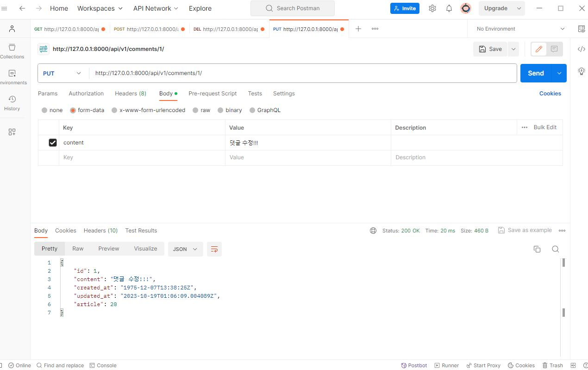

# Django REST framework 2

## 참고

OAS(Open API Specification) 기반으로 API 문서를 생성하는데 도움을 주는 오픈소스 프레임 워크에 대해서 안내 드립니다. 

django rest framework 공식문서에 언급되는 documenting API 관련 third party 라이브러리로는 2가지 프로젝트가 존재합니다.

- drf-yasg
- drf-spectacular
두개의 가장 큰 차이점은 drf-spectacular는 openAPI3.0버전을 지원을 하지만 drf-yasg는 지원하지 않습니다.
그래서 라이브 교제에는 drf-spectacular 설치 및 등록하는 법에 대해서 안내가 있네요.

drf-spectacular 사용법은 교재에도 있지만 참고 자료로 한번 훑어 보셔도 좋을것 같은 자료 링크 남깁니다.

1. Drf-spectacular 관련 자료
https://techblog.yogiyo.co.kr/django-rest-framework-api-document-generator-feat-drf-spectacular-585fcabec404

2. drf-yasg 관련 자료
https://backstreet-programmer.tistory.com/m/174


## DRF with N:1 Relation

## 사전 준비

### Comment 모델 정의

#### Comment 클래스 정의 및 데이터베이스 초기화


#### Migration 및 fixtures 데이터 로드

```
$ python manage.py makemigrations
$ python manage.py migrate
$ python manage.py loaddata articles.json comments.json
```

### URL 및 HTTP request method 구성


## GET

### GET - List

#### 댓글 목록 조회를 위한 CommentSerializer 정의


#### url 작성


#### view 함수 작성


### GET - Deatail

#### 단일 댓글 조회를 위한 url 및 view 함수 작성


## POST

### POST

#### 단일 댓글 생성을 위한 url 및 view 함수 작성
- 댓글에 대한 POST는 url, view 함수 공유가 불가능하다
- 행위에 관한 구체적인 항목은 url에 작성하지 않는다. (메서드로 표현한다)


- raise_exception
  - is_valid()는 유효성 검사 오류가 있는 경우 ValidationError 예외를 발생시키는 raise_exception 인자를 사용할 수 있음
  - DRF에서 제공하는 기본 예외 처리기에 의해 자동으로 처리되며 기본적으로 HTTP 400 응답을 반환 (코드 반복을 제거해줌)

- serializer 인스턴스의 save() 메서드는 특정 Serializer 인스턴스를 저장하는 과정에서 추가 데이터를 받을 수 있음
- save(article=article)
- Serializer에서는 commit=False를 사용하지 않는다.


- 상대코드 400 응답
- CommentSerializer에서 외래 키에 해당하는 article field 또한 사용자로부터 입력 받도록 설정되어 있기 때문에 서버 측에서 누락되었다고 판단한 것
- article field가 유효성 검사 전에 입력이 되어 버렸다

### 읽기 전용 필드
- 데이터를 전송하는 시점에 "유효성 검사에서 제외" 시키고, "데이터 조회 시에는 출력" 하는 필드


## DELETE & PUT

### DELETE & PUT

#### 단일 댓글 삭제 및 수정을 위한 view 함수 작성


- comment detail 에서 작성
- 댓글은 일부만 수정할 수 있는 케이스가 없기 때문에 partial 옵션이 필요 없다




## 응답 데이터 재구성

### 댓글 조회 시 게시글 출력 내역 변경


- 댓글 조회 시 게시글 번호만 제공해주는 것이 아닌 '게시글의 제목' 까지 제공하기

- 클래스 안에서 새로운 클래스를 정의
- 필요한 데이터를 만들기 위한 Serializer는 내부에서 추가 선언 가능


- 덮어씌우지 않는 fields에 대해서만 읽기 전용 필드를 사용할 수 있다
- read_only=True 옵션을 사용


## 역참조 데이터 구성

### Article -> Comment 간 역참조 관계를 활용한 JSON 데이터 재구성

- 아래 2가지 사항에 대한 데이터 재구성하기
1. 단일 게시글 조회 시 '해당 게시글에 작성된 댓글 목록 데이터'도 함께 붙여서 응답 
2. 단일 게시글 조회 시 '해당 게시글에 작성된 댓글 개수 데이터'도 함께 붙여서 응답 (신규 필드)

### 1. 단일 게시글 + 댓글 목록

#### Nested relationships
- 모델 관계 상으로 참조하는 대상은 참조되는 대상의 표현에 포함되거나 중첩될 수 있음 
- 이러한 중첩된 관계는 serializers를 필드로 사용하여 표현 가능
- 읽기 전용필드로 사용하지 않을 경우 is_valid 에서 comment_set field도 유효성 검사를 하게 됨 


### 2. 단일 게시글 + 댓글 개수 (새로운 필드)

#### 댓글 개수에 해당하는 새로운 필드 선언

- 'source'
  - 필드를 채우는데 사용할 속성의 이름
  - 점 표기법(dotted notation)을 사용하여 속성을 탐색할 수 있음

- comment_set.count() ORM 문법을 사용 (Article 모델 Serialzier이기 때문에 article 인스턴스를 쓰지 않는다.)


### [주의] 읽기 전용 필드 지정 이슈
- 특정 필드를 override 혹은 추가한 경우 read_only_fields는 동작하지 않음
- 해당 필드의 read_only 키워드 인자로 작성해야함

## API 문서화

### OpenAPI Specification (OAS)

- RESTful API를 설명하고 시각화하는 표준화된 방법
- -> API에 대한 세부사항을 기술할 수 있는 공식 표준


### OAS 기반 API에 대한 문서를 생성하는데 도움을 주는 오픈소스 프레임워크


### drf-spectacular 라이브러리

- https://drf-spectacular.readthedocs.io/en/latest/

#### DRF 위한 OpenAPI 3.0 구조 생성을 도와주는 라이브러리
- 설치 및 등록

```
$ pip install drf-spectacular
```


#### 관련 설정 코드 입력 (OpenAPI 스키마 자동 생성 코드)


- 위치는 상관 없다

#### swagger, redoc 페이지 제공을 위한 url 작성

- 프로젝트 url에 작성


### OAS의 핵심 이점 - "설계 우선" 접근법
- API를 먼저 설계하고 명세를 작성한 후, 이를 기반으로 코드를 구현하는 방식
- API의 일관성을 유지하고, API 사용자는 더 쉽게 API를 이해하고 사용할 수 있음
- 또한, OAS를 사용하면 API가 어떻게 작동하는지를 시각적으로 보여주는 문서를 생성할 수 있으며, 이는 API를 이해하고 테스트하는데 매우 유용
- 이런 목적으로 사용되는 도구 Swagger-UI 또는 ReDoc

## 참고

### Django shortcuts function
- render()
- redirect()
- get_object_or_404()
- get_list_or_404()

### get_object_or_404()
- 모델 manager objects 에서 get()을 호출하지만, 해당 객체가 없을 땐 기존 DoesNotExist 예외 대신 "Http404를 raise"함
- 단일 데이터
- API 데이터 개발을 할 때 적합하게 사용할 수 있다

### get_object_or_404 적용


### get_list_or_404()
- 모델 manager objects에서 filter()의 결과를 반환하고, 해당 객체 목록이 없을 땐 "Http404를 raise" 함
- 다중 데이터
- API 데이터 개발을 할 때 적합하게 사용할 수 있다


- 이전에는 상태 코드 500을 응답했지만 현재는 404를 응답

### 왜 사용해야 할까?
- 클라이언트에게 "서버에 오류가 발생하여 요청을 수행할 수 없다(500)"라는 원인이 정확하지 않은 에러를 제공하기 보다는, 적절한 예외 처리를 통해 클라이언트에게 보다 정확한 에러 현황을 전달하는 것도 매우 중요한 개발 요소 중 하나이기 때문