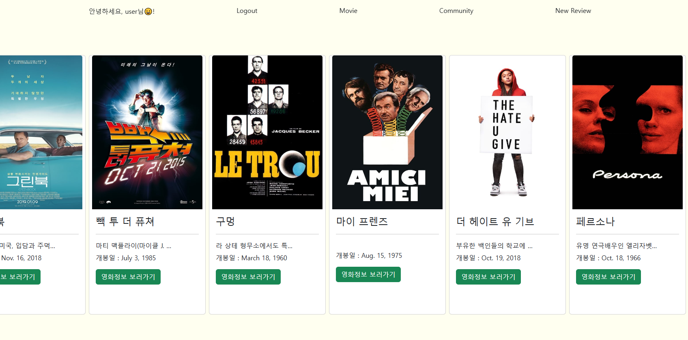

## 프로젝트명

> 비동기 통신을 이용한 웹 사이트 구현

## 시행 날짜 

> 2023.11.03(금)

## 팀원

> 최성호, 김지용

## 개발도구 및 라이브러리

> VSCode, Django 4.2.6, djangorestframework, Chrome Browser

## 개발 목표 

> <li> 데이터를 생성, 조회, 수정, 삭제할 수 있는 Web Application 제작 • AJAX 통신과 JSON 구조에 대한 이해
> <li> Many to one relationship(N:1)에 대한 이해
> <li> Many to many relationship(N:M)에 대한 이해
> <li> accounts, community, movies  각각의 앱에 비동기 통신이 필요한 부분을 axios를 이용해 구현 ( 좋아요 , 팔로우 )
> <li> Movies 앱의 전체 영화 목록 조회, 단일 영화 상세 조회 ( 로그인 / 비로그인 시 적절한 UI를 활용하여 영화 목록을 제공 )
> <li> 영화 추천 기능 ( 사용자의 인증 여부와 관계없이 단일 영화 상세 조회 페이지에서 적절한 UI를 활용하여 형화 정보를 제공 )
> <li> 단일 리뷰 상세 조회 페이지에서 좋아요 기능 / 댓글의 개수 / 댓글 삭제 / 대댓글, 대댓글 삭제버튼

# 구현

### 1. 전체 / 단일 페이지에 대한 적절한 화면 제공 

### 2. 좋아요, 팔로우 기능을 비동기적으로 구현

### 3. 댓글 및 댓글 삭제 구현

### 4. 전체 페이지에서 화면을 스크롤 하는 과정에서 base.html은 상단에 고정
### 5. community에서 좋아요의 개수, 좋아요 기능
### 6. profile 에서 팔로우/ 팔로워 개수

# 구현하지 못한부분

## 1. profile 화면에서 팔로우 / 팔로워 개수 뿐만아니라 누가 팔로워 했는지 / 누구를 팔로우했는지 구현하려 했는데 실패

## 2. 대댓글 생성 및 대댓글을 삭제를 비동기적으로 구현하려 했지만 실패

## ERD

## 느낀점

> 수업에서 다루었던 javascript axios을 프로젝트에서 좋아요나 팔로우 같이 페이지의 새로고침이 없이도 작동할 수 있는 부분을 직접 구현하니 비동기의 필요성을 확실하게 느끼게 되었다.

> 부스트트랩을 이용하면서 프론트를 진행했을때 그저 코드 복사를 했었는데 코드 복사 후 값을 조금씩 바꾸다보니 원하던 결과물에 더욱 가까워질 수 있었고, 부스트트랩을 포함한 HTML, CSS까지 이해도가 더 높아진 것 같다.

> 지금까지 몇 번의 프로젝트를 진행하면서 백엔드 부분을 마무리하고 프론트엔드로 넘어갔기에 프론트엔드 부분은 크게 신경쓰지 못하고 프로젝트를 마무리 하게 되었던 부분이 많았다. 하지만 이번 프로젝트는 백엔드 부분과 프론트엔드 부분을 동시에 진행하게 되면서 백엔드의 코드 값에 따라 프론트도 같이 변하는 과정을 직관적으로 확인할 수 있었던 부분이 개발적으로 더욱 다가왔던 것 같다. 지금까지 프로젝트 과정에 view 프레임워크를 얹어서 프로젝트를 진행해보고 싶다!