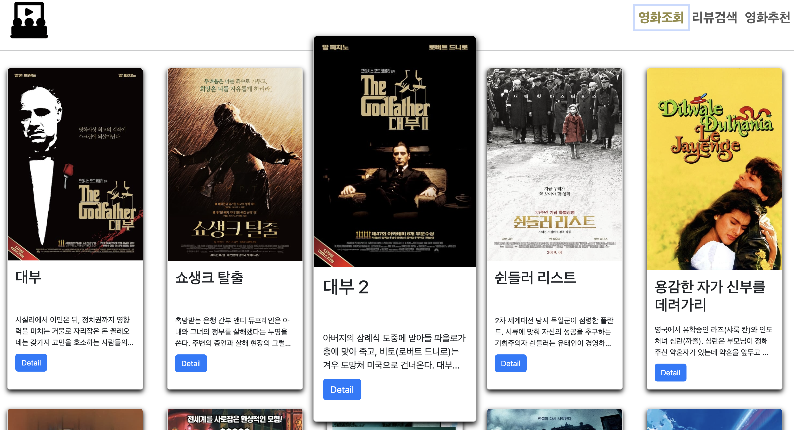
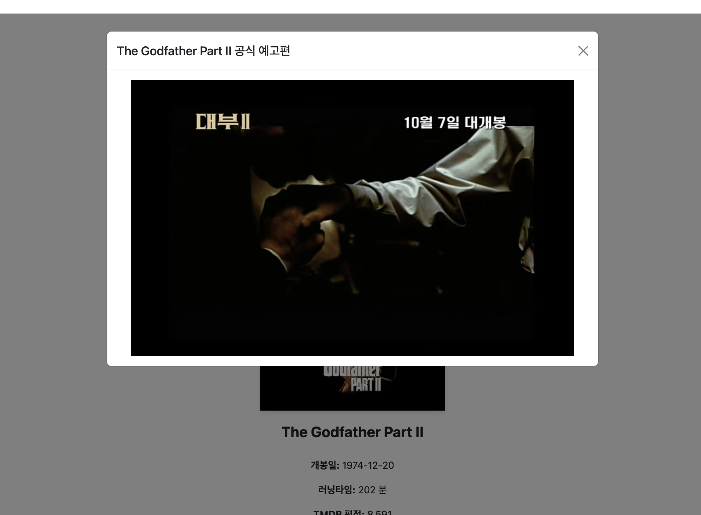
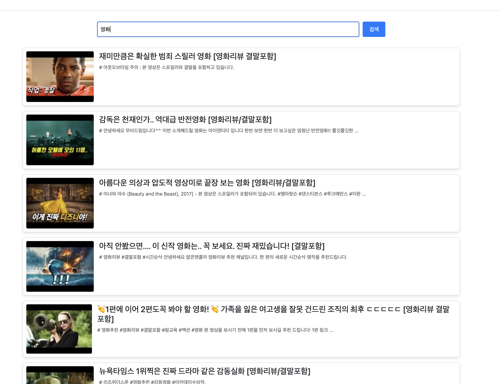
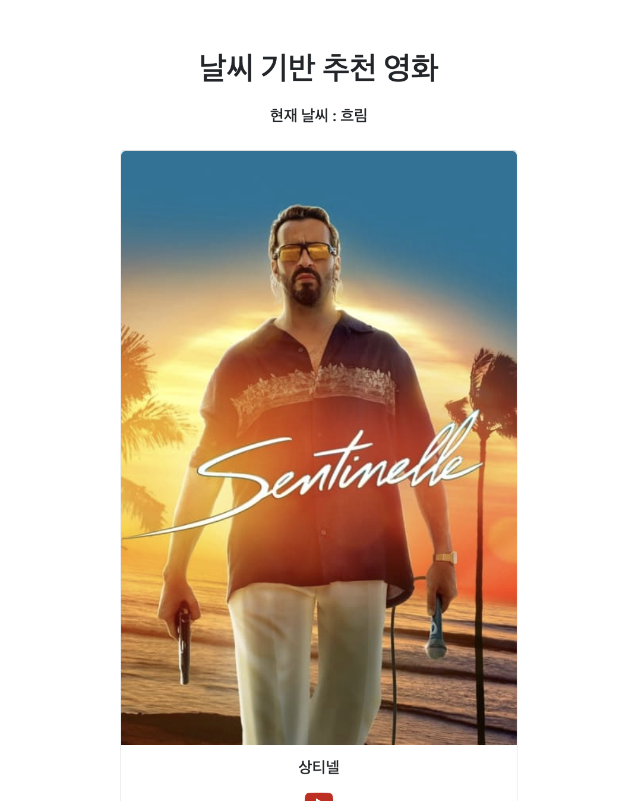

## 프로젝트명

> Vue를 활용한 SPA구성

## 시행 날짜 

> 2023.11.10(금)

## 팀원

> 최성호, 김지용

## 개발도구 및 라이브러리

> VSCode, Vue, Chrome Browser

## 개발 목표 

> <li> 영화 정보를 제공하는 SPA 제작
> <li> AJAX 통신과 JSON 구조에 대한 이해
> <li> TMDB API를 TOP Rated로 부터 제공받아 영화정보를 받아 정보를 제공
> <li> YOUTUBE API를 제공받아 영화 세부화면에서 영화 예고편 기능을 제공
> <li> Weather API를 제공받아 날씨별 추천 영화를 보여주는 기능을 제공

# 구현

### 1. 전체 / 세부 페이지에 대한 적절한 화면 제공 

### 2. 세부 페이지에서 youtube API를 가져와 예고편을 제공

### 3. 영화 리뷰 영상을 조회하는 기능

### 4. 날씨 API를 통해 날씨별 영화 추천 기능

## VIEW 컴포넌트 구조

## 느낀점

> VUE를 이용해 영화추천 사이트를 구현해 보니 Vue는 컴포넌트 기반의 프레임워크로 ref, reactive, computed 등을 사용하여 컴포넌트 간의 데이터를 효과적으로 관리할 수 부분이 매력적으로 다가왔고, Vue Router를 사용하여 페이지 간의 이동과 동적 라우팅을 구현하는 것이   Django를 사용할때보다 훨씬 용이했다. 특히 params를 활용하여 동적 라우트를 쉽게 다룰 수 있었다.
또한 API 제공받아 프로젝트를 진행한 부분은 다음 웹 개발에 있어서 큰 도움이 될 것같다