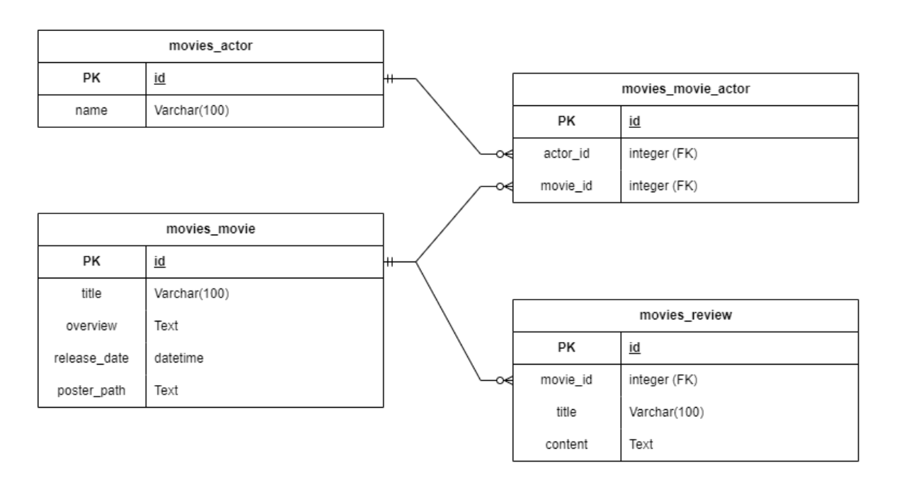

## 프로젝트명

> DB 설계를 활용한 REST API 설계 

## 시행 날짜 

> 2023.10.27(금)

## 팀원

> 최성호, 김지용

## 개발도구 및 라이브러리

> VSCode, Django 4.2.6, djangorestframework, Chrome Browser, Postman

## 개발 목표 

> <li> DRF(django rest framework)를 활용한 API Server제작
> <li> Many to one relationship(N:1)에 대한 이해
> <li> Many to many relationship(N:M)에 대한 이해
> <li> Actor, Movie, Review 모델 생성 후 각각의 함수에 사용할 serializer생성

## 목차

> 1. model작성 후 fixture data를 받아줌 
> 2. Actor, Movie, Review 모델 생성
> 3. Actor, Movie, Review의 전체, 세부 정보를 제공하는 view 함수 작성
> 4. 각각의 veiw함수에 대한 serializer를 작성
> 5. Postman을 통해 API를 확인

## 프로젝트 설명

## ERD

## 느낀점

> serializer로 json형식의 데이터들을 변환하면 id형식으로 반환되기 때문에 
serializer.py에서 오버라이딩을 통해 부모 클래스의 동작을 수정해 줘야한다.

> serialize에 대한 이해도는 있었지만 프로젝트를 통한 실습은 serialize이용하여 
json형태로 변환하는 방법에 있어서 더욱 확실하게 알게되었다.